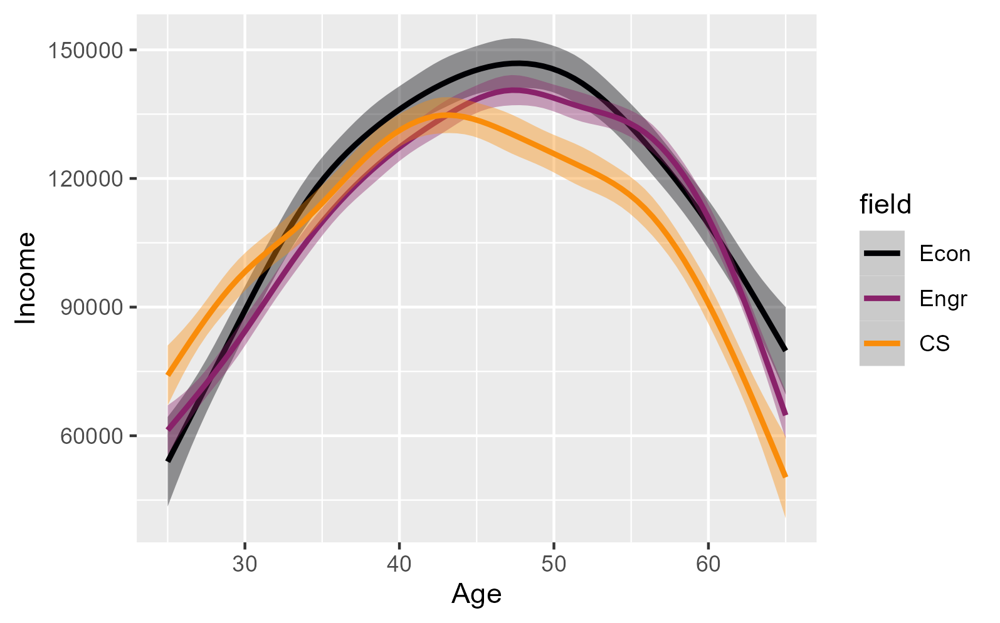
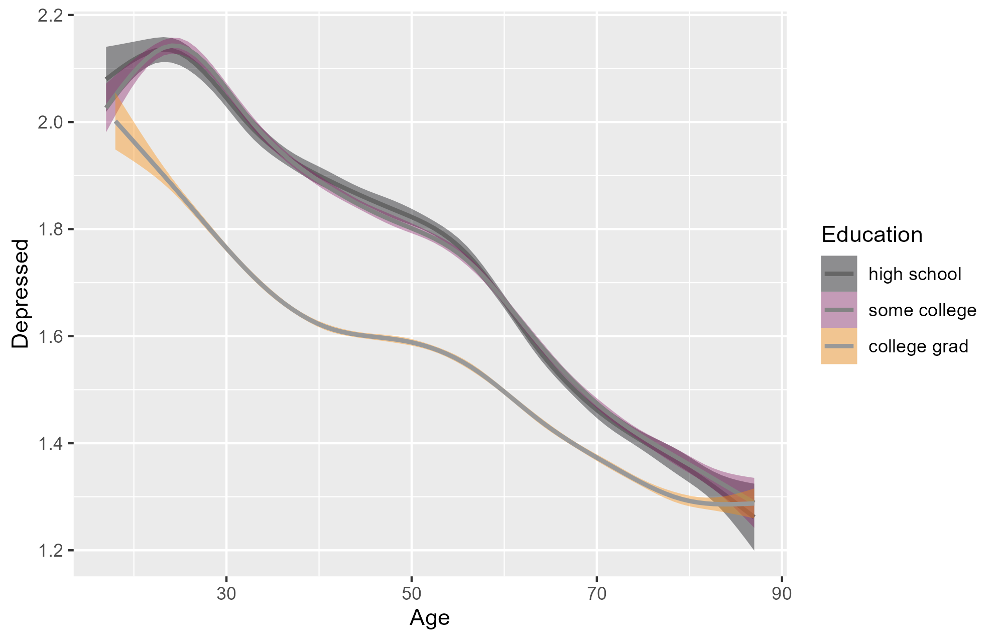

R Basics for Lecture 1
================

## Econ B2000, Statistics and Introduction to Econometrics

## Kevin R Foster, Colin Powell School, the City College of New York, CUNY

For this class we’ll be using the statistical analysis program, R. The
computer labs here on campus have the necessary software. If you have
your own computer, download and install the program from [R
Project](http://www.r-project.org/) along with
[R-Studio](http://www.rstudio.com/). Depending on your particular device
these details will be different so take it patiently and figure it out -
there are sufficient online sources for help, to address any problem
that arises.

The best way to learn it is to just do it. How many times have you got a
new game, skipped reading the instructions, and learned by crashing it a
few times? This isn’t quite so simple but the basic gist remains - try
it. Below I give you some pointers about how to just do it, but they’re
meant to be read then immediately done in real life, I’ll give you some
commands to just copy-and-paste into the program.

The program, R, is the machine underneath that does the work, while
R-Studio is a skin on top that makes it easier to use. Install both then
run R-Studio, and you’ll get something that looks like this: 

The screen has 4 parts: the Console at lower left (where I drew the
green arrow) is most important since that’s where you type in the
commands to R.

You can start by just copying and pasting commands from this document
into the “Console” and seeing the output from the program.

The guide, *An Introduction to R*, suggests these commands to give a
basic flavor of what’s done and hint at the power. Don’t worry too much
about each step for now, this is just a glimpse to show that with a few
commands you can do some relatively sophisticated estimation – i.e. for
a small cost you can get a large benefit. Copy them and paste into the
“Console”.

``` r
x <- 1:50
w <- 1 + sqrt(x)/2
example1 <- data.frame(x=x, y= x + rnorm(x)*w)
attach(example1)
```

This creates x and y variables (where the rnorm command creates random
numbers from a normal distribution), puts them into a data frame, then
attaches that data frame so that R can use it in later calculations.
(What’s a data frame? A way to collect together related data items.)
Next some stats - create a linear model (that’s the “lm”) then a
“lowess” nonparametric local regression, and plot the two estimations to
compare. (Just copy and paste these, don’t worry about understanding
them for now!)

``` r
fm <- lm(y ~ x)
summary(fm)
```

    ## 
    ## Call:
    ## lm(formula = y ~ x)
    ## 
    ## Residuals:
    ##     Min      1Q  Median      3Q     Max 
    ## -8.2519 -2.0464 -0.0222  2.5556  8.2224 
    ## 
    ## Coefficients:
    ##             Estimate Std. Error t value Pr(>|t|)    
    ## (Intercept)  -0.1104     0.9640  -0.115    0.909    
    ## x             0.9894     0.0329  30.072   <2e-16 ***
    ## ---
    ## Signif. codes:  0 '***' 0.001 '**' 0.01 '*' 0.05 '.' 0.1 ' ' 1
    ## 
    ## Residual standard error: 3.357 on 48 degrees of freedom
    ## Multiple R-squared:  0.9496, Adjusted R-squared:  0.9485 
    ## F-statistic: 904.3 on 1 and 48 DF,  p-value: < 2.2e-16

``` r
lrf <- lowess(x, y)
plot(x, y)
lines(x, lrf$y)
abline(0, 1, lty=3)
abline(coef(fm))
```

``` r
detach()
```

Your own graph should look similar although with the random numbers, not
exactly.

The final “detach” command just cleans up, it is the opposite of
“attach”.

Later you will find that while it is possible to go back and fix up code
that you previously ran in R (the up arrow brings most recent commands),
it is a bit of a pain. It is easier to write out the code in the
upper-left panel, then R-Studio can obediently run all or part of it in
R for you (as you hit Ctrl-Enter, it runs each line). Then if you make a
mistake or just want to do it again, it’s a bit easier. You can save
your code for next time, as well.

One big thing to learn is that while pushing buttons is easier at first,
eventually you want to be able to write code. I won’t insist that you do
that from day 1, but keep it in mind as a goal to work towards. In R,
you can usually see the code generated by the button-pushes so you can
learn.

For all of these commands, you can use the help box on R Studio. But as
I said, don’t worry much about those commands for now, I’m not expecting
you to become an R-ninja overnight.

# Some examples

Working with the Social Mobility Lab here at the Colin Powell School,
I’ve been looking at different data about the difference in various life
outcomes for people with college degrees.

This graph shows average wages earned by people with different
undergraduate majors, in 2021, with data from the Census Bureau’s
American Community Survey, selecting 3 particular high-earning majors:
economics, engineering (civil, mechanical, or electrical), and computer
science. You can see the typical hump shape of wages.

<figure>

<figcaption aria-hidden="true">image of wage differences by college
major</figcaption>
</figure>

I like the graph for the balance between simplicity and complexity. The
simplicity is that this is not using any fancy model, this is just
looking at the average wage for people of a particular age and major –
there is some smoothing being done but the bands show the statistical
uncertainty and it’s not very substantial. But the complexity is that,
if you look at younger ages you can see that very early, CS majors earn
more, but the other majors catch up and surpass as people got older. The
combination of simplicity and complexity is meant to entice the audience
to ask more questions: why this pattern? It looks like economics majors
edge out engineering majors, how certain can we be about that? Could
there be an issue where CS majors are more likely to retire early (so
their measured wage falls)? This graph inevitably muddles different
influences: people who are older typicially earned a college degree a
couple decades ago, so the difference in wage trajectories could be due
to their initial degree or to different influences over time – the
returns to a CS degree might be more cyclical.

Here’s another graph, again with age on the horizontal axis. This time
the vertical axis shows how often respondents said they were depressed
in the last two weeks, so higher numbers are worse. I group people by
completed education: whether they have a four-year degree or more,
whether they have some college but not 4 years, or whether they just
have a high-school diploma. (I’ve omitted people who didn’t even finish
high school, but they have it worse.)

<figure>

<figcaption aria-hidden="true">image of depression differences by
college degree</figcaption>
</figure>

Again I think the mix of simplicity and complexity is useful and – I
hope! – intriguing to the audience. Mental health improves as people get
older; all the lines trend down. The separation is also clear: people
with a college degree have much better mental health than those without.
Although there is less of a gap for the very young and the very old. But
the gap is sizable: a college grad who is 30 has about same mental
health as a highschool grad at 55 or so. This should pique questions:
why that correlation? What direction might be the causation – maybe
people with worse mental health are less likely to get a degree, or
maybe people who get a degree can attain better mental health. If the
latter, is the cause from just education or is it about income (that
college degree causes higher income which causes better mental health)?
And what other factors are we omitting, that might be important?

# With Some Data

We will go through some basic stats with R using the Census Bureau’s
Household Pulse Data, a survey about how people were doing during and
after Covid times. I will help you get some quick wins before circling
back to get into more detail. This is the data source for the graph
above, on mental health.

But before we get to the fun stuff, you have to learn a bit about your
computer’s filing system. When you download stuff it probably goes into
a Download folder. When you installed R and R-Studio, those went into
their own folders (probably within some Application folder) and then the
program might have created a R folder for your work.

It’s now time to be intentional and organized. Create a folder for your
R work. Within that folder, create a separate folder for each project
that you work on – so for this project, create a folder called
“ecob2000_lecture1”.

Go and download the Household Pulse data from the [class
page](http://kfoster.ccny.cuny.edu/classes/fall2025/), which will likely
put that file into your Downloads folder. Find that file,
d_all_May2025.RData, probably in downloads - move that into your new
folder, ecob2000_lecture1.

R will look for files in a particular directory or folder (same concept
just different words). Type the command, “getwd()” to see where it’s
currently looking. Then use the command, “setwd,” to tell it where it
ought to be looking (the R/ecob2000_lecture1 folder that you created
just now, or wherever you put that data file). Alt you can click
“Session” then “Set Working Directory” then “Choose Directory” and click
the folder, and that will insert the “setwd” command onto the Console
line. Tell R to look for the data in the folder where you put the data.
Even better is to use R Studio’s Project function [here’s more
detail](https://www.r-bloggers.com/rstudio-projects-and-working-directories-a-beginners-guide/).

Then run these commands (output from those commands is below),

``` r
load("d_HHP2020_24.RData")
#glimpse(d_HHP2020_24) try this later
d_HHP2020_24[1:10,1:6]
```

    ##    Age Gender    Education Mar_Stat income_midpoint  Race
    ## 1   34 female college grad  Married           62500 white
    ## 2   65   male some college divorced           30000 white
    ## 3   44 female college grad  Married          225000 other
    ## 4   56   male some college divorced           12500 white
    ## 5   57 female   adv degree    never           62500 white
    ## 6   44 female   adv degree  Married          125000 white
    ## 7   37 female   adv degree  Married           62500 Black
    ## 8   59   male college grad  Married           82500 white
    ## 9   51 female        lt hs    never           12500 Black
    ## 10  29 female    assoc deg  Married           40000 white

``` r
attach(d_HHP2020_24)
```

The data is structured that each row is a person, so the first person is
somebody who is 34 years old, is female, has a college degree, is
married, has income (reported in bands) with midpoint \$62,500, is
white, and then there is a lot more data in the other variables. Next
row, row two, is 65, male, with some college but no degree, married,
income \$225,000, reporting race as “other”; third row 56 years old
male, etc, etc. ; then on for many more rows.

You can also use the command, summary, to find out about data.

``` r
summary(d_HHP2020_24)
```

    ##       Age           Gender              Education           Mar_Stat     
    ##  Min.   :17.00   male  :410536   lt hs       :  6787   Married  :556611  
    ##  1st Qu.:39.00   female:566464   some hs     : 14934   widowed  : 54162  
    ##  Median :52.00   trans :  1989   high school :122541   divorced :152705  
    ##  Mean   :52.25   other :  5801   some college:210698   separated: 17850  
    ##  3rd Qu.:65.00                   assoc deg   :103575   never    :195037  
    ##  Max.   :88.00                   college grad:279400   NA's     :  8425  
    ##                                  adv degree  :246855                     
    ##  income_midpoint     Race                Hispanic      Number_people_HH
    ##  Min.   : 12500   white:806002   not Hispanic:895979   Min.   : 1.000  
    ##  1st Qu.: 40000   Black: 80846   Hispanic    : 88811   1st Qu.: 2.000  
    ##  Median : 82500   Asian: 48885                         Median : 2.000  
    ##  Mean   : 95461   other: 49057                         Mean   : 2.715  
    ##  3rd Qu.:125000                                        3rd Qu.: 4.000  
    ##  Max.   :225000                                        Max.   :10.000  
    ##  NA's   :187771                                                        
    ##  Number_kids_HH  Number_adults_HH                    private_health_ins
    ##  Min.   :0.000   Min.   : 1.000   0                           : 74413  
    ##  1st Qu.:0.000   1st Qu.: 2.000   has private health insurance:607599  
    ##  Median :0.000   Median : 2.000   no private health insurance :149384  
    ##  Mean   :0.623   Mean   : 2.092   NA's                        :153394  
    ##  3rd Qu.:1.000   3rd Qu.: 2.000                                        
    ##  Max.   :5.000   Max.   :10.000                                        
    ##                                                                        
    ##                    public_health_ins                             work_kind     
    ##  0                          : 74413   employed by govt                : 96450  
    ##  has public health insurance:302958   employed by private co          :320047  
    ##  no public health insurance :425600   employed by nonprofit or charity: 74364  
    ##  NA's                       :181819   self employed                   : 68547  
    ##                                       work for family business        : 11698  
    ##                                       NA's                            :413684  
    ##                                                                                
    ##                               workloss           DOWN           ANXIOUS      
    ##  yes recent household loss of work:171404   Min.   :1.00     Min.   :1.00    
    ##  no                               :794667   1st Qu.:1.00     1st Qu.:1.00    
    ##  NA's                             : 18719   Median :1.00     Median :2.00    
    ##                                             Mean   :1.63     Mean   :1.91    
    ##                                             3rd Qu.:2.00     3rd Qu.:2.00    
    ##                                             Max.   :4.00     Max.   :4.00    
    ##                                             NA's   :108234   NA's   :106951  
    ##      WORRY           INTEREST           YEAR         Begin_Date        
    ##  Min.   :1.00     Min.   :1.00     Min.   :20.00   Min.   :2020-04-23  
    ##  1st Qu.:1.00     1st Qu.:1.00     1st Qu.:20.00   1st Qu.:2020-12-09  
    ##  Median :1.00     Median :1.00     Median :22.00   Median :2022-04-27  
    ##  Mean   :1.72     Mean   :1.65     Mean   :21.73   Mean   :2022-05-03  
    ##  3rd Qu.:2.00     3rd Qu.:2.00     3rd Qu.:23.00   3rd Qu.:2023-08-23  
    ##  Max.   :4.00     Max.   :4.00     Max.   :24.00   Max.   :2024-07-23  
    ##  NA's   :108419   NA's   :108683                                       
    ##      K4SUM        income_midpoint_factor
    ##  Min.   : 4.00    125000 :145006        
    ##  1st Qu.: 4.00    62500  :134183        
    ##  Median : 6.00    82500  :112727        
    ##  Mean   : 6.91    225000 : 92900        
    ##  3rd Qu.: 8.00    40000  : 85421        
    ##  Max.   :16.00    (Other):226782        
    ##  NA's   :111831   NA's   :187771

So this shows that there are 984,790 people in this dataset.

### Simple Stats

We compare the average age by gender in the data,

``` r
summary(Age[Gender == "female"])
```

    ##    Min. 1st Qu.  Median    Mean 3rd Qu.    Max. 
    ##   17.00   39.00   52.00   51.62   64.00   88.00

``` r
summary(Age[Gender == "male"])
```

    ##    Min. 1st Qu.  Median    Mean 3rd Qu.    Max. 
    ##   17.00   40.00   54.00   53.29   67.00   88.00

``` r
summary(Age[Gender == "trans"])
```

    ##    Min. 1st Qu.  Median    Mean 3rd Qu.    Max. 
    ##   17.00   26.00   31.00   36.02   41.00   88.00

``` r
summary(Age[Gender == "other"])
```

    ##    Min. 1st Qu.  Median    Mean 3rd Qu.    Max. 
    ##   17.00   31.00   43.00   45.88   59.00   88.00

This uses the factor variable, Gender, which asks people about their
current gender identity.

Males in this dataset are, on average, a bit older, with an average age
of 53.3 compared with 51.6 for females. You might wonder (if you were to
begin to think like a statistician) whether that is a big difference -
hold onto that thought!

Alternately you can use the commands to calculate the average, mean(),
and the standard deviation, sd(), to get those statistics:

``` r
mean(Age[Gender == "female"])
```

    ## [1] 51.61668

``` r
sd(Age[Gender == "female"])
```

    ## [1] 15.59165

``` r
mean(Age[Gender == "male"])
```

    ## [1] 53.28593

``` r
sd(Age[Gender == "male"])
```

    ## [1] 16.28551

Later you might encounter cases where you want more complicated dummy
variables and want to use logical relations “and” “or” “not” (the
symbols “&”, “\|”, “!”) or the “\>=” or multiplication or division.

As you’re going along, if you’re copying-and-pasting then you might not
have had trouble, but if you’re typing then you’ve probably realized
that R is persnickety - the variable Age is not equivalent to age nor
AGE nor aGe… You might be wondering if there’s an easier way than
copy-paste; *there is*. If you highlight text in the Source pane and
then hit CTRL-Enter, that will run the block of code. Alt if you click
the “Knit HTML” button from the Rmd file then that will recreate the
webpage as well as run all of the commands.

### More Details

At the beginning you’ll be just copying commands that I give you but as
you start making changes, you have to understand what’s going on.

For better or worse there is rarely just a single way of doing things,
when people talk about the R language it does indeed have many features
of a language. Just like a spoken language has many ways of saying “hi”
so too there are lots of different ways to ask R to produce means of
different groups. I am showing you a few particular ways but if you look
around online you’ll find others.

Remember to save your work. The computers in the lab wipe the memory
clean when you log off so back up your files. GitHub is the best way to
do that – especially since you’ll be collaborating on work.

But be careful - you have the option of saving your code and/or your
workspace; it is always better to save just the code. For example, your
code might load some data (at this stage, usually data that I’ve
provided). If you make changes to this data during your session, you do
not want to restart with those changes. If you just save your code and
re-run the program, you will start fresh. If instead you save the
workspace, then you end up saving all of your scraps and changes - which
eventually start to build up. So only save your workspace if you’ve run
a large chunk of code that you don’t want to have to later re-run. (This
is even more true if you “attach” data frames without later “detach”-ing
them!)

This is a whole different approach to workflow and project management.
The old bad way is to have something like an Excel sheet, where a human
goes through and makes a few changes to the original data – and these
changes might well be smart and good! But they don’t replicate and
they’re even tough to remember after some time. And it’s tough to track
back and find errors, whether they are typos or were in the original
data.

We will be using 2 main file types: R script (lines of instructions to R
on how to calculate some statistics) and R Markdown (which combines the
instructions to R along with text around it, which is how I created this
file). There are more types of course but those are the ones for now.

There is a bigger philosophy behind this: the idea of “reproducible
research,” that if you share your .Rmd file then anybody else can run
the exact same program and get the exact same results. It’s a way of
convincing an audience that there was no skulduggery in how the data
relates to the conclusion. It’s useful in class since it’s an easy way
to submit homework or share work with your study group.

Sharing is caring. You’ve got to get in the habit of knowing that your
code is not some personal scratch file that only has to work for you.
Most workplaces are in teams so the code has to be understandable more
broadly. And if you recall from Behavioral Economics, there are times
where it’s useful to think of your future self as a different person. (I
do that! I load old code that I wrote and sometimes yell, “I hate the
frickin a-hole who wrote this code!”) So set good habits right from the
beginning. If you have your own desk in your own office then maybe it’s
a mess, that’s your choice. But if you share a space then you know you
have to be neater and not be that slob that everybody else hates. Your
coding too. You will share code with your study group.

You will put your code on GitHub – that’s how you will work with your
study group and how you’ll submit homework. If you decide to work in the
field, you will want to share examples of your code and GitHub is the
standard.

Create an account on GitHub – first [here’s Jenny Bryan with a great
explanation of the
why](https://dx.doi.org/10.7287%2Fpeerj.preprints.3159v2), then [she
gives complete instructions here](https://happygitwithr.com/index.html).
Go read the first about why, then read her parts 4 and 5 and create your
account. You’ll eventually read the whole thing carefully.

Each set of coding should be a Project – in RStudio, that’s a particular
thing. In File menu, find “New Project”. Each project has its own folder
along with subfolders within for data and output. Above I asked you to
create a R folder with subfolders within for each project including
ecob2000_lecture1 for this one.

In your code, use the comments generously. I sometimes first use the
comments to write what I’m trying to do as a way to set down my goals
for each segment. Then can implement them with the following code.
Again, be mindful that other people (and your future self) will be
trying to follow along with your code to understand what’s going on.

In the next part (Lecture 1 A) I’ll go a bit deeper into the coding,
talk about packages in R, and get into some details about the data.
