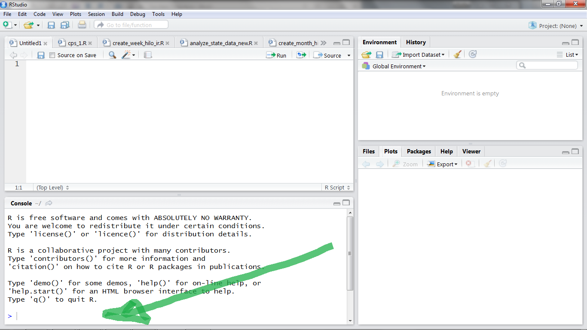

## Econ B2000, Statistics and Introduction to Econometrics
## Kevin R Foster, Colin Powell School, the City College of New York, CUNY

For this class we'll be using the statistical analysis program, R. The computer labs here on campus have the necessary software. If you have your own computer, download and install the program from [R Project](http://www.r-project.org/) along with [R-Studio](http://www.rstudio.com/). Depending on your particular device these details will be different so take it patiently and figure it out - there are sufficient online sources for help, to address any problem that arises. 

The best way to learn it is to just do it. How many times have you got a new game, skipped reading the instructions, and learned by crashing it a few times? This isn't quite so simple but the basic gist remains - try it. Below I give you some pointers about how to just do it, but they're meant to be read then immediately done in real life, I'll give you some commands to just copy-and-paste into the program.

The program, R, is the machine underneath that does the work, while R-Studio is a skin on top that makes it easier to use. Install both then run R-Studio, and you'll get something that looks like this:


The screen has 4 parts: the Console at lower left (where I drew the green arrow) is most important since that's where you type in the commands to R.

You can start by just copying and pasting commands from this document into the "Console" and seeing the output from the program.

The guide, *An Introduction to R*, suggests these commands to give a basic flavor of what's done and hint at the power. Don't worry too much about each step for now, this is just a glimpse to show that with a few commands you can do some relatively sophisticated estimation -- i.e. for a small cost you can get a large benefit. Copy them and paste into the "Console".

```{r message=FALSE}
x <- 1:50
w <- 1 + sqrt(x)/2
example1 <- data.frame(x=x, y= x + rnorm(x)*w)
attach(example1)
```
This creates x and y variables (where the rnorm command creates random numbers from a normal distribution), puts them into a data frame, then attaches that data frame so that R can use it in later calculations. (What's a data frame? A way to collect together related data items.) Next some stats - create a linear model (that's the "lm") then a "lowess" nonparametric local regression, and plot the two estimations to compare. (Just copy and paste these, don't worry about understanding them for now!)

```{r}
fm <- lm(y ~ x)
summary(fm)
lrf <- lowess(x, y)
plot(x, y)
lines(x, lrf$y)
abline(0, 1, lty=3)
abline(coef(fm))
detach()
```

Your own graph should look similar although with the random numbers, not exactly.

The final "detach" command just cleans up, it is the opposite of "attach".

Later you will find that while it is possible to go back and fix up code that you previously ran in R (the up arrow brings most recent commands), it is a bit of a pain. It is easier to write out the code in the upper-left panel, then R-Studio can obediently run all or part of it in R for you (as you hit Ctrl-Enter, it runs each line). Then if you make a mistake or just want to do it again, it's a bit easier. You can save your code for next time, as well.

One big thing to learn is that while pushing buttons is easier at first, eventually you want to be able to write code. I won't insist that you do that from day #1, but keep it in mind as a goal to work towards. In R, you can usually see the code generated by the button-pushes so you can learn.

For all of these commands, you can use the help box on R Studio. But as I said, don't worry much about those commands for now, I'm not expecting you to become an R-ninja overnight.

# With Some Data

We will go through some basic stats with R using the Census Bureau's Household Pulse Data, a survey about how people were doing in Covid times. I will help you get some quick wins before circling back to get into more detail.

You have to learn a bit about your computer's filing system. When you download stuff it probably goes into a Download folder. When you installed R and R-Studio, those went into their own folders (probably within some Application folder) and then the program might have created a R folder for your work. 

It's now time to be intentional and organized. Create a folder for your R work. Within that folder, create a separate folder for each project that you work on -- so for this project, create a folder called "ecob2000_lecture1".

Go and download the Household Pulse data from the [class page](http://kfoster.ccny.cuny.edu/classes/fall2022/), which will likely put that zip file into your Downloads folder. Within that zip file is one particular file, Household_Pulse_data.RData - move that into your new folder, ecob2000_lecture1.

Note that you can't just download the zip file and run the program, you have to extract the particular .RData file -- that regularly trips up people as they begin.

R will look for files in a particular directory or folder (same concept just different words). Type the command, "getwd()" to see where it's currently looking. Then use the command, "setwd," to tell it where it ought to be looking (the R/ecob2000_lecture1 folder that you created just now, or wherever you put that data file). Alt you can click "Session" then "Set Working Directory" then "Choose Directory" and click the folder, and that will insert the "setwd" command onto the Console line. Tell R to look for the data in the folder where you put the data. Even better is to use R Studio's Project function [here's more detail](https://www.r-bloggers.com/rstudio-projects-and-working-directories-a-beginners-guide/).


Then run these commands (output from those commands is below),
```{r}

load("Household_Pulse_data.RData")
#glimpse(acs2017_ny) try this later
acs2017_ny[1:10,1:7]
attach(acs2017_ny)

```
In the next section I'll explain more about the data and what the lines mean but for now AGE is the person's age in years and female is a 0/1 variable (takes value 1 for true and 0 for false). So if you look at the output, see that the first person on line 1 is a 72-year-old female, next is a 72-year-old male, then a 31-year-old male, etc. The set of variables beginning "educ_" are also 0/1 so the first 2 people have advanced degrees and next 2 have college degrees.

You can also use the command, summary, to find out about data.

```{r}
summary(acs2017_ny)
print(NN_obs <- length(AGE))
```
So this shows that there are `r prettyNum(NN_obs, big.mark = ",")` people in this dataset.

### Simple Stats
We compare the average age of the men and the women in the data,

```{r}
summary(AGE[female == 1])
summary(AGE[!female])
```
This uses the female dummy variable. The comparison is between those who have the variable female=1 (i.e. women) and those not female=1 (so logical not, denoted with the "!" symbol, i.e. men). *I know, you can -- and people do! -- worry that this binary classification for gender misses some people; government statistics are just not there yet. Progress is slower than we'd like.*

Women in this dataset are, on average, a bit older, with an average age of `r round(mean(AGE[female == 1]), digits = 1)` compared with `r round(mean(AGE[female != 1]), digits = 1)` for men. You might wonder (if you were to begin to think like a statistician) whether that is a big difference - hold onto that thought!
Alternately you can use the commands to calculate the average, mean(), and the standard deviation, sd(), to get those statistics:

```{r}
# here i want to find average ages of men and women
mean(AGE[female == 1])
sd(AGE[female == 1])
mean(AGE[!female])
sd(AGE[!female])
```
Later you might encounter cases where you want more complicated dummy variables and want to use logical relations "and" "or" "not" (the symbols "&", "|", "!") or the ">=" or multiplication or division.

As you're going along, if you're copying-and-pasting then you might not have had trouble, but if you're typing then you've probably realized that R is persnickety - the variable AGE is not equivalent to Age nor age nor aGe... You might be wondering if there's an easier way than copy-paste; *there is*. If you highlight text in the Source pane and then hit CTRL-Enter, that will run the block of code. Alt if you click the "Knit HTML" button from the Rmd file then that will recreate the webpage as well as run all of the commands.

### More Details
At the beginning you'll be just copying commands that I give you but as you start making changes, you have to understand what's going on.

For better or worse there is rarely just a single way of doing things, when people talk about the R language it does indeed have many features of a language. Just like a spoken language has many ways of saying "hi" so too there are lots of different ways to ask R to produce means of different groups. I am showing you a few particular ways but if you look around online you'll find others.

Remember to save your work. The computers in the lab wipe the memory clean when you log off so back up your files. GitHub is the best way to do that -- especially since you'll be collaborating on work.

But be careful - you have the option of saving your code and/or your workspace; it is always better to save just the code. For example, your code might load some data (at this stage, usually data that I've provided). If you make changes to this data during your session, you do not want to restart with those changes. If you just save your code and re-run the program, you will start fresh. If instead you save the workspace, then you end up saving all of your scraps and changes - which eventually start to build up. So only save your workspace if you've run a large chunk of code that you don't want to have to later re-run. (This is even more true if you "attach" data frames without later "detach"-ing them!)

This is a whole different approach to workflow and project management. The old bad way is to have something like an Excel sheet, where a human goes through and makes a few changes to the original data -- and these changes might well be smart and good! But they don't replicate and they're even tough to remember after some time. And it's tough to track back and find errors, whether they are typos or were in the original data.

There are 2 main file types: R script (lines of instructions to R on how to calculate some statistics) and R Markdown (which combines the instructions to R along with text around it, which is how I created this file). There are more types of course but those are the ones for now. 

There is a bigger philosophy behind this: the idea of "reproducible research," that if you share your .Rmd file then anybody else can run the exact same program and get the exact same results. It's a way of convincing an audience that there was no skulduggery in how the data relates to the conclusion. It's useful in class since it's an easy way to submit homework or share work with your study group. 

Sharing is caring. You've got to get in the habit of knowing that your code is not some personal scratch file that only has to work for you. Most workplaces are in teams so the code has to be understandable more broadly. And if you recall from Behavioral Economics, there are times where it's useful to think of your future self as a different person. (I do that! I load old code that I wrote and sometimes yell, "I hate the frickin a-hole who wrote this code!") So set good habits right from the beginning. If you have your own desk in your own office then maybe it's a mess, that's your choice. But if you share a space then you know you have to be neater and not be that slob that everybody else hates. Your coding too. You will share code with your study group.

You will put your code on GitHub -- that's how you will work with your study group and how you'll submit homework. If you decide to work in the field, you will want to share examples of your code and GitHub is the standard.

Create an account on GitHub -- first [here's Jenny Bryan with a great explanation of the why](https://dx.doi.org/10.7287%2Fpeerj.preprints.3159v2), then [she gives complete instructions here](https://happygitwithr.com/index.html). Go read the first about why, then read her parts 4 and 5 and create your account. You'll eventually read the whole thing carefully.

Each set of coding should be a Project -- in RStudio, that's a particular thing. In File menu, find "New Project". Each project has its own folder along with subfolders within for data and output. Above I asked you to create a R folder with subfolders within for each project including ecob2000_lecture1 for this one.

In your code, use the comments generously. I sometimes first use the comments to write what I'm trying to do as a way to set down my goals for each segment. Then can implement them with the following code. Again, be mindful that other people (and your future self) will be trying to follow along with your code to understand what's going on.

In the next part (Lecture 1 A) I'll go a bit deeper into the coding, talk about packages in R, and get into some details about the PUMS data.

